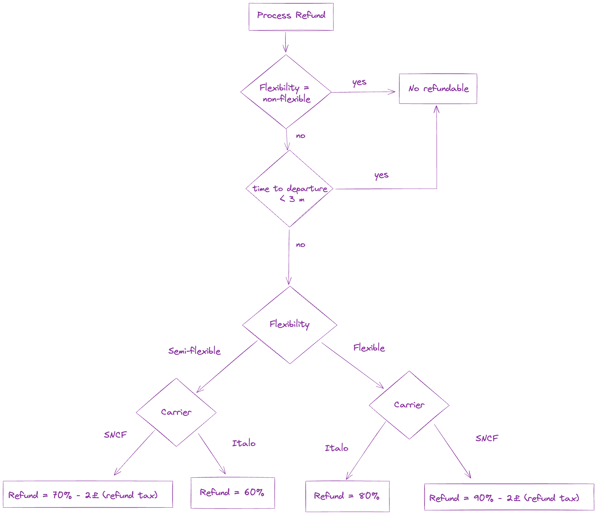

# Notes for the candidate

- Not all the code will have to remain as it is for the exercise to be completed, and it doesn't matter if you are not familiar with all the stack as you will be able to use search the web for documentation.
- You should verify you can run the [getting started commands](#getting-started) successfully from your machine - you should end up with the Create React App screen.
- You should spend a little time looking at the way the project is structured. At the moment of writing this the key libraries are React, TypeScript and Express so the boilerplate uses these. There are example tests for both the client and the server.
- During the interview we'll introduce the stories and acceptance criteria we would like you to work on.

## Getting started

    nvm install
    yarn
    yarn start

## Available Scripts

In the project directory, you can run:

### `yarn start`

Runs the app in the development mode. 
Open [https://localhost:5001](https://localhost:5001) to view it in the browser.

The page will reload if you make edits. 
You will also see any lint errors in the console.

### `yarn test`

Launches the test runner in the interactive watch mode. 
See the section about [running tests](https://facebook.github.io/create-react-app/docs/running-tests) for more information.

## Project checklist

After starting the project in development mode (`yarn start`), you can check if both client and server are working as expected:

1. Client homepage: [https://localhost:5001](https://localhost:5001)
2. Server endpoints
    - Ping/Pong: [https://localhost:8443/ping](https://localhost:8443/ping)
    - List all bookings: [https://localhost:8443/bookings](https://localhost:8443/bookings)

During the excercise, you'll be able to `fetch` from the server endpoints using a relative path on the client so you don't have to deal with CORS issues.

## Troubleshooting

- You see '`Something is already running on port 5001.`' when running `yarn:start`.

Ensure the `Airplay Receiver` is disabled from `System Preferences > Sharing`.

## Current refund process
The current implementation of refund follow the next rules:

